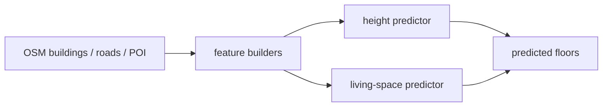

# floor-predictor

[](https://github.com/aimclub/OSA)

OSM-based building floor and living-space prediction experiments. The repo prepares building/amenity/road features and runs the prediction notebooks.

## System Map



## Saved Results

No saved result image is tracked in this repo yet. Keep future validation maps or metric plots under `docs/` or `outputs/` before linking them here.

## Run

Entrypoint: `pipeline.ipynb`

Human:

```bash
pip install -e . && jupyter notebook pipeline.ipynb
```

Agent: inspect feature coverage and missing-value rates before trusting predicted floor/living-area outputs.

## Publication

No standalone publication tracked; support repo for urban morphology inputs.

## Next Steps / Heuristics

Heuristic: prefer simple OSM-derived predictors and transparent feature tables; only add model complexity when it beats clear baselines on held-out cities.

